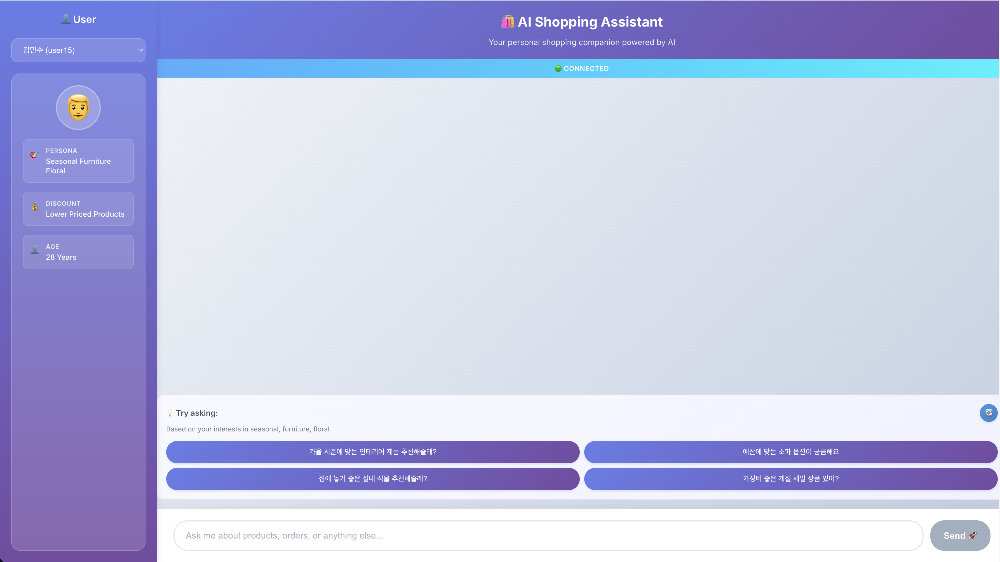

# Bedrock Shopping Assistant 🛍️

An AI-powered shopping assistant built with AWS services, featuring real-time chat, personalized recommendations, and intelligent product search.

## 🌟 Features

- 🤖 **Intelligent Chat**: Real-time WebSocket communication with Claude 3.5 Haiku
- 🎯 **Personalized Recommendations**: AI-generated suggestions based on user behavior
- 🔍 **Product Search**: Fast, scalable search with OpenSearch Serverless
- 👤 **User Profiles**: Detailed personas and shopping behavior tracking

## 📸 Screenshots


*Main interface with chat and recommendations*


*Real-time product search*

## 🏗️ Architecture

```
┌─────────────────────┐    ┌─────────────────────┐
│  OpenSearchStack    │    │   DynamoDBStack     │
│  - Product Search   │    │   - User Data       │
└─────────────────────┘    └─────────────────────┘
         │                           │
         └─────────┬─────────────────┘
                   │
         ┌─────────▼─────────┐
         │  WebFrontendStack │
         │  - React Frontend │
         │  - WebSocket API  │
         └───────────────────┘
```

## 🚀 Quick Start

### Prerequisites
- AWS CLI configured
- Node.js 18+
- Python 3.10
- AWS CDK v2

### Setup & Deploy
```bash
./deploy.sh
```

## 📁 Project Structure

```
bedrock-shopping-agent/
├── 📁 stacks/                   # CDK Infrastructure
│   ├── 📁 opensearch/           # Search infrastructure
│   ├── 📁 dynamodb/             # Database tables
│   └── 📁 webfrontend/          # Frontend + APIs
├── 📁 lambda/                   # Backend functions
│   ├── 📁 websocket/            # Real-time chat
│   └── 📁 recommend_next_chat/  # Next chat recommendations
│   └── 📁 ingest_opensearch/    # OpenSearch data ingetsion
├── 📁 frontend/                 # React application
│   ├── 📁 src/
│   │   ├── 📁 components/       # UI components
│   │   ├── 📁 services/         # API clients
│   │   └── 📁 data/             # User data
├── 📁 layers/                   # Lambda layers (generated by install_layers.sh)
├── 📁 images/                   # Product images
├── 📄 install_layers.sh         # Layer installation script
└── 📄 app.py                    # CDK app entry point
```

> **Note**: The `layers/` folder is generated by running `./install_layers.sh` and should not be committed to version control. It contains Python dependencies for Lambda functions.
